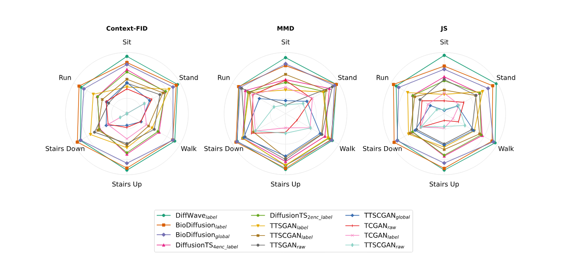
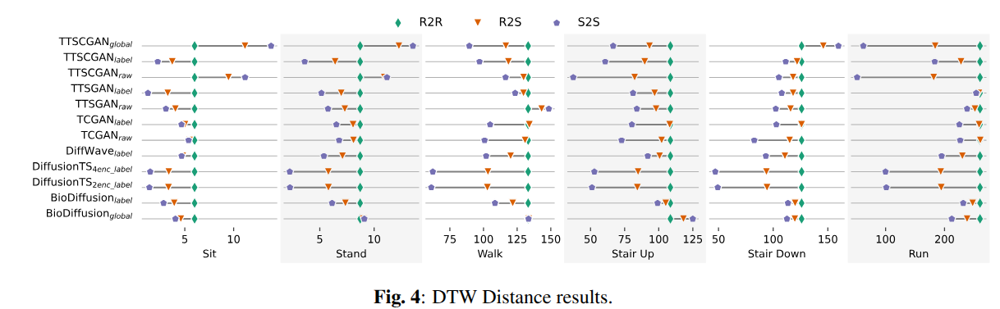
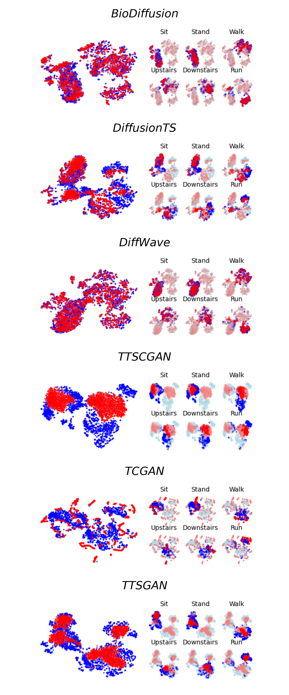

# IMUEval – Synthetic IMU Data Evaluation Pipeline

This repository provides **IMUEval**, a reproducible and modular pipeline for generating and evaluating **synthetic inertial data** for Human Activity Recognition (HAR).
It is built on **PyTorch Lightning**, and supports three stages:

1. **Generative Model Training** – train from scratch or load from checkpoint.  
2. **Synthetic Data Generation** – produce synthetic samples and save them.  
3. **Synthetic Data Evaluation** – run metrics comparing real vs. synthetic data.

---

## Experimental Units

Each experiment (referred to as an *experimental unit*) is defined by three YAML configuration files:

- **pipelines** → execution strategy (trainer, devices, callbacks, task).  
- **models** → generative model definition and hyperparameters.  
- **data_modules** → dataset preprocessing, batching, and normalization.  

These files are located in the `benchmarks/base_configs` directory, each in its respective subdirectory (e.g., `benchmarks/base_configs/data_module`).  

This modular design ensures that experiments are **reproducible**, **extensible**, and **scalable**.  
Experiment orchestration is handled through a **CSV file**, where each row specifies a combination of pipeline, data, and model configurations, along with optional overrides.


---

## Supported Models

We evaluate six state-of-the-art models for synthetic IMU data generation:

* GAN-based models

    * TCGAN ([Original Implementation](https://arxiv.org/abs/2309.04732))

    * TTS-GAN ([Original Implementation](https://arxiv.org/abs/2202.02691))

    * TTS-CGAN ([Original Implementation](https://arxiv.org/abs/2206.13676))

* Diffusion-based models

    * BioDiffusion ([Original Implementation](https://arxiv.org/abs/2401.10282))

    * DiffusionTS ([Original Implementation](https://arxiv.org/abs/2403.01742))

    * DiffWave ([Original Implementation](https://arxiv.org/abs/2009.09761))

---

## Example: CSV Experiment Definition

```csv
execution/id,model/config,model/name,model/override_id,data/data_module,data/view,data/dataset,data/partition,data/name,data/override_id,pipeline/task,pipeline/name,pipeline/override_id,backbone/load_from_id,ckpt/resume
generate_train_biodiffusion_normalized_all,train,diffusion_biodiffusion_norm_all,,multimodal_df,daghar_standardized_balanced_normalized_all,all,train,*,,har,train_generate_synth_normalized_all,train_100,,
generate_train_biodiffusion_normalized_label,train,diffusion_biodiffusion_norm_label,,multimodal_df,daghar_standardized_balanced_normalized_label,all,train,*,,har,train_generate_synth_normalized_label,train_100,
generate_train_biodiffusion_random_normalized_all,train,diffusion_biodiffusion_random_norm_all,,multimodal_df,daghar_standardized_balanced_normalized_all,all,train,*,,har,train_generate_synth_normalized_all,no_train,,
generate_train_biodiffusion_random_normalized_label,train,diffusion_biodiffusion_random_norm_label,,multimodal_df,daghar_standardized_balanced_normalized_label,all,train,*,,har,train_generate_synth_normalized_label,no_train,,
```

---

## Evaluation Metrics

IMUEval provides both **quantitative** and **qualitative** metrics for assessing synthetic data:

* **Fidelity** → Context-FID (C-FID), Jensen-Shannon Divergence (JS), Maximum Mean Discrepancy (MMD).

* **Diversity** → Dynamic Time Warping (DTW).

* **Utility** → Discriminative Score (DS), Predictive Score (PS).

* **Visualization** → t-SNE (time and frequency domain).

Metrics can be run at **class-level granularity**, ensuring fine-grained insights into generative performance.

Metrics can be computed at the class level, enabling fine-grained insights into generative performance.
Additionally, new metrics can be seamlessly integrated into the evaluation pipeline. This is a standard feature of our framework, with examples and guides available in the [metrics]() file.
## Repository Structure

```plaintext
.
├── benchmarks
│   ├── base_configs/
│   │   ├── pipeline/     # Training/evaluation execution configs
│   │   ├── models/       # Model hyperparameter configs
│   │   └── datamodule/   # Dataset and preprocessing configs
│   │
│   ├── experiments/
│   │   ├── example/      # Minimal working example
│   │   └── synth_data_generation_icassp/   # ICASSP experiment
│   │       ├── configs/                    # Execution plan (.csv) files
│   │       │   └── overrides/              # Config override files
│   │       ├── icassp_pipeline/
│   │       │   ├── callback/               # Data Generation callback and others
│   │       │   ├── checkpoints/            # Model checkpoints (.ckpt)
│   │       │   │   └── embedder/
│   │       │   ├── data/                   # Real and synthetic datasets
│   │       │   ├── datamodule/             
│   │       │   ├── figs/                   # Figures (static plots, illustrations)
│   │       │   ├── metrics/                # Computed metric outputs
│   │       │   ├── models/                 # Saved model definitions
│   │       │   ├── plots/                  # Visualizations (t-SNE, etc.)
│   │       │   └── results/                # Final evaluation results
│   │
│   └── README.md   # Explanation of the benchmarks framework
│
├── figures/        # Global figures for the main README or paper
├── LICENSE
└── README.md       # Project overview and results summary

```
---

## Results(case study)

### 0. What we've got

* Diffusion models (BioDiffusion, DiffWave, DiffusionTS) consistently outperform GANs.

* DiffWave shows stable performance across all activity classes.

* GAN models (TCGAN, TTS-GAN, TTS-CGAN) generate plausible signals but are more easily distinguishable from real data.

* DTW analysis reveals diffusion models better preserve diversity.

* DS and PS metrics confirm diffusion models generate more useful and less distinguishable samples.

### 1. Predictive Score (PS) and Discriminative Score (DS)

| Model                                 |        PS ↓          |         DS ↓         |
|---------------------------------------|----------------------|----------------------|
| BioDiffusion<sub>global</sub>         | 0.8664 ± 0.0027      | 0.2754 ± 0.0031      |
| BioDiffusion<sub>rand-global</sub>    | 4.9214 ± 0.1795      | 0.4999 ± 0.0001      |
| **BioDiffusion<sub>label</sub>**      | **0.8641 ± 0.0016**  | 0.2264 ± 0.0041      |
| BioDiffusion<sub>rand-label</sub>     | 1.8688 ± 0.0599      | 0.5000 ± 0.0000      |
| DiffusionTS<sub>2enc-label</sub>      | 0.9915 ± 0.0052      | 0.3535 ± 0.0031      |
| DiffusionTS<sub>2enc-rand-label</sub> | 1.6167 ± 0.0388      | 0.4998 ± 0.0023      |
| DiffusionTS<sub>4enc-label</sub>      | 0.9929 ± 0.0029      | 0.3580 ± 0.0022      |
| DiffusionTS<sub>4enc-rand-label</sub> | 1.6424 ± 0.0202      | 0.4987 ± 0.0002      |
| **DiffWave<sub>label**                | 0.8838 ± 0.0035      | **0.1258 ± 0.0042**  |
| DiffWave<sub>rand-label</sub>         | 757.0222 ± 323.1032  | 0.5000 ± 0.0000      |
| TCGAN<sub>raw</sub>                   | 1.2209 ± 0.0080      | 0.4996 ± 0.0002      |
| TCGAN<sub>rand-raw</sub>              | 1.2079 ± 0.0017      | 0.4997 ± 0.0000      |
| TCGAN<sub>label</sub>                 | 1.2355 ± 0.0084      | 0.4993 ± 0.0002      |
| TCGAN<sub>rand-label</sub>            | 1.2064 ± 0.0106      | 0.4997 ± 0.0002      |
| TTSGAN<sub>raw</sub>                  | 1.8038 ± 0.0195      | 0.4743 ± 0.0029      |
| TTSGAN<sub>rand-raw</sub>             | 1.3028 ± 0.0303      | 0.5000 ± 0.0000      |
| TTSGAN<sub>label</sub>                | 1.0310 ± 0.0074      | 0.4668 ± 0.0026      |
| TTSGAN<sub>rand-label</sub>           | 1.4038 ± 0.0144      | 0.4999 ± 0.0000      |
| TTSGAN<sub>global</sub>               | 1.4484 ± 0.0333      | 0.4998 ± 0.0002      |
| TTSGAN<sub>rand-global</sub>          | 1.5671 ± 0.0232      | 0.5000 ± 0.0000      |
| TTSCGAN<sub>raw</sub>                 | 1.2371 ± 0.0108      | 0.4992 ± 0.0002      |
| TTSCGAN<sub>label</sub>               | 1.5999 ± 0.0180      | 0.4998 ± 0.0000      |
| TTSCGAN<sub>global</sub>              | 1.2461 ± 0.0088      | 0.4996 ± 0.0002      |
| TTSCGAN<sub>rand-global</sub>         | 1.8953 ± 0.0220      | 0.5000 ± 0.0000      |

The **Predictive Score (PS)** measures whether synthetic data can train a model that generalizes well to real data, while the **Discriminative Score (DS)** evaluates whether a classifier can distinguish real from synthetic samples.  
Both metrics use simple neural networks: a 2-layer GRU for PS and a 2-layer MLP for DS.

- **Diffusion models** clearly outperform GANs in both PS and DS.  
- **BioDiffusion (label)** achieved the **lowest PS**, meaning its generated data were the most useful for prediction.  
- **DiffWave (label)** obtained the **lowest DS**, showing it produced data closest to real distributions, capable of reaching the closest to 50% of accuracy with the MLP.
- GAN variants clustered near DS ≈ 0.5, indicating that they are easily distinguished from real data.  
- We also included **random baselines** (e.g., BioDiffusion<sub>rand</sub>, DiffusionTS<sub>rand</sub>, TCGAN<sub>rand</sub>) to show how performance degrades when labels are randomized or signals are unstructured. As expected, they performed poorly, serving as a lower bound for model comparison.

### 2. Fidelity Metrics – Radar Plots


*Figure 1: FFT t-SNE results of a parcial synthetic dataset generated by each of the techniques trained with normalization by label of the dataset DAGHAR.*

The radar plots above show per-class results for **Context-FID**, **MMD**, and **JS divergence**, where **larger values (towards the outer edges)** indicate better fidelity. The models with the **largest filled areas** correspond to better performance, and the legend is ordered **top to bottom, left to right** for easier comparison.

- **Diffusion models (DiffWave, BioDiffusion, DiffusionTS)** dominate across almost all classes.  
- **GANs (TTS-GAN, TCGAN, TTSCGAN)** show weaker and less stable performance.  
- Performance is consistent across activity classes, with diffusion models especially excelling in *Sit* and *Walk*.  

These plots highlight that **diffusion-based models produce synthetic data distributions much closer to the real ones** compared to GANs.

### 3. Diversity Metrics – DTW Similarity


*Figure 2: DTW Results of the synthetic dataset generated by each technique.*

The DTW (Dynamic Time Warping) plots compare similarity between samples:  
- **R2R (real-to-real)** = natural diversity of real data  
- **R2S (real-to-synthetic)** = closeness of synthetic samples to real ones  
- **S2S (synthetic-to-synthetic)** = diversity within synthetic data  

**Interpretation**:  
- When **R2S values are close to R2R**, synthetic data is well aligned with real data distributions.  
- When **S2S is close to R2R**, synthetic data exhibits a diversity comparable to real data.  
- If **S2S shifts left (lower values)**, the model collapses to less diverse synthetic samples.

**Findings**:  
- Diffusion models (DiffWave, BioDiffusion, DiffusionTS) show strong alignment between R2S and R2R, confirming good realism.  
- Some GANs (e.g., TCGAN) achieve competitive R2S values but fail on diversity (S2S much lower than R2R).  
- This indicates that GANs often generate “average-like” samples rather than diverse ones.  

Together, these results demonstrate that **diffusion models generate not only realistic but also diverse IMU data**, while GANs often struggle with diversity and fidelity simultaneously.

### 4. Qualitative Visualization – t-SNE in the Frequency Domain


*Figure 3: FFT t-SNE results of a parcial synthetic dataset generated by each of the techniques trained with normalization by label of the dataset DAGHAR.*

The plots above show **t-SNE projections** of real (blue) and synthetic (red) samples in the **frequency domain**.  
On the **left**, we see the overall distribution of data for each model, while on the **right**, the samples are split by activity class (*Sit, Stand, Walk, Upstairs, Downstairs, Run*).

**Key observations:**

- **Diffusion models (BioDiffusion, DiffusionTS, DiffWave)**:  
  - Generate synthetic clusters that strongly overlap with the real ones.  
  - DiffWave in particular reproduces distributions with minimal separation between real and synthetic data.  
  - This confirms their superior fidelity, as also seen in Context-FID, MMD, and JS metrics.

- **GAN models (TTSCGAN, TCGAN, TTSGAN)**:  
  - Often form **separate synthetic clusters**, sometimes collapsing around “average-like” representations.  
  - This explains why they show lower diversity in DTW and higher DS values (synthetic samples easier to classify as fake).  
  - For example, TCGAN tends to generate compact clusters overlapping partially with real data, but fails to capture the full distribution.

---

## Useful Links:
- [DAGHAR Dataset on Zenodo](https://zenodo.org/records/13987073)
- [Base Framework (GitHub)]()
- [Synthetic sets created by our experiments]()
